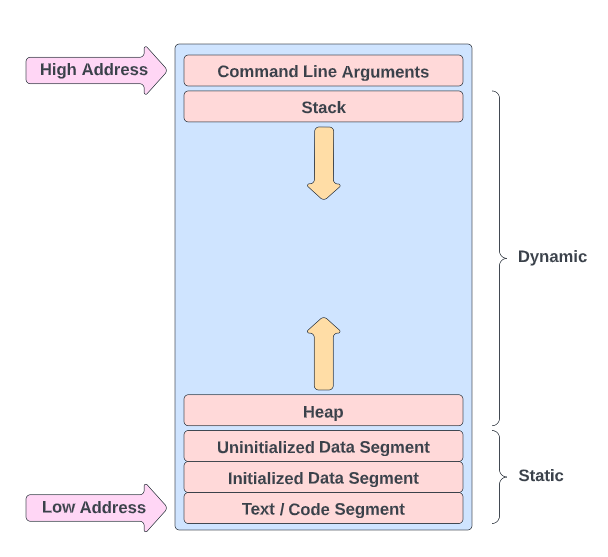
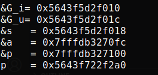
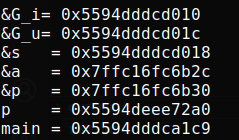

# Embedded Systems Study Group

- [Embedded Systems Study Group](#embedded-systems-study-group)
- [Memory Layout in C](#memory-layout-in-c)
- [Function Pointers](#function-pointers)
- [Struct Padding](#struct-padding)

# Memory Layout in C
The binary executable file, which is created after compiling the `.c` file, gets loaded in a structured fashion composed of 6 segments or regions. Access to each region is mediated by read / write permissions of that region. Size of certian segments is fixed and some may grow or shrink at runtime.



We have studied storage classes, dynamic and static memory allocation, the stack, the heap and the text / code segment lets put all this together using following example. Copy the code, compile and run it.

``` C
#include <stdio.h>
#include <stdlib.h>

int G_i = 23 ;   /* Initialized global variable.*/
int G_u;   /* Uninitialized global variable.*/

int main(int argc, char **argv)
{
    static int s;   /* static local variable, stored in BSS segment */
    int a;   /* automatic variable, stored on stack */
    int *p;   /* pointer variable for malloc below */

    p = malloc(sizeof(int));

    printf("&G_i = %p\n", &G_i);
    printf("&G_u = %p\n", &G_u);
    printf("&s   = %p\n", &s);
    printf("&a   = %p\n", &a);
    printf("&p   = %p\n", &p);
    printf("p    = %p\n", p);

    free(p);

    return 0;
}
```
<details>
<summary>See Output</summary>
Output will be similar to this.
<br>

<br>
</details>

|Variable   |Region                          |Lifetime
|-----------|--------------------------------|---------------------|
G_u         |Uninitialized Data Segment      | Until program ends.
G_i         |Initialized Data Segment        | Until program ends.
s           |Uninitialized Data Segment      | Until program ends.
a           |Stack frame of main()           | Until main() exits.
p           |Stack frame of main()           | Until main() exits.

Here the pointer `p` is allocated inside the stack frame of the `main()` function but it points to a location inside the heap. The variables `argc` and `argv` will be stored in the `Command line arguments section.`

# Function pointers.

In the above code lets try to print the address of main.
```C
printf("main = %p\n", main);
```
<details>
<summary>See Output</summary>
Output will be similar to this.
<br>

<br>
</details>

Every function has an address associated with it which points to the executable code of the function. Using this address we can call the function and pass the function as an arguments to other functions. This address that points to a function is called function pointer.

Note: The address corresponding to main is the lowest one, since it is stored in the `text` segment and that is present at lower addresses in the memory layout.

## Function pointers decleration syntax.

The type of a pointer to a function is based on both the return type and parameter types of the function. A declaration of a pointer to a function must have the pointer name in parentheses. Function parameters have precedence over pointers in declarations, so parentheses are required to alter the precedence and declare a pointer to a function. Without them, the compiler interprets the declaration as a function that returns a pointer to a specified return type.

``` C
int (*fun_ptr)(int);     // pointer to a function returning an int
```

## Calling a function using function pointers.

We can declare function pointers and poin them to valid function definations. The functio pointed by the function pointer can be called as shown in the below code.
``` C
int add(int a, int b)
{
	return a + b;
}

int multiply(int a, int b)
{
	return a * b;
}

int calculator(int (*operation)(int, int), int a, int b)
{
    printf("The result of the operatio is : %d \n",operation(a,b));
}

int main()
{
	int a = 7, b = 10;

	int (*fun_ptr)(int , int);  // Function pointer decleration.

	fun_ptr = add;
	printf(" a + b = %d\n",fun_ptr(a,b));
	
	fun_ptr = multiply;
	printf(" a * b = %d\n",fun_ptr(a,b));

	// Passing functions as an argument to the calculator function.
	calculator(add, a, b);
	calculator(multiply, a, b);
}
```
Uses of function pointers:
* Implementing callback routines, interupt service routines.
* Passing a function as an argument to some other function.
* Virtual functions in C++

# TODO: Assignment on function pointers.

# Struct Padding
CPU does not read the data from the memory one byte at a time, rather it reads one word at a time. The compiler adds padding between the struct members to reduce the number of CPU cycles while accessing the struct members. For this the data members need to be `self aligned`.

What is data alignment ?

Data alignment specifies that the data members must be places at memory addresses that are the mulitples of it size. `chars` can start on any byte address, but 2-byte `shorts` must start on an even address, 4-byte `ints` or `floats` must start on an address divisible by 4, and 8-byte `longs` or `doubles` must start on an address divisible by 8. To achive self-alignment the compiler adds padding between the data members of the struct. Consider the following example.

```C
struct A
{
	char x;		/* 1 byte */
	int y;		/* 4 bytes */
};

int main()
{
	printf("Size of struct A: %lu\n", sizeof(struct A));
}
``` 
With alignment:
<!-- Diagram -->
Without alignment: 
<!-- Diagram -->

When dealing with arrays of struct, a struct instance will itself have the alignment of its widest scalar data member. Consider the following example

``` C
struct B {
    double a;	 /* 8 bytes */
    char b;      /* 1 byte */
};

struct C {
	float a;	/* 4 bytes */
	char b;		/* 1 byte */
};

int main()
{
	struct B b;
	struct B arr_B[4];
	struct C c;
	struct C arr_C[4];

	printf("%lu\n",sizeof(b));
	printf("%lu\n",sizeof(arr_B));
	printf("%lu\n",sizeof(c));
	printf("%lu\n",sizeof(arr_C));
}
```
<details>
<summary>Output</summary>
<br>
Add output Image here.
</details>
<!-- Paste output -->
struct B instances will have alignment of 8 bytes, struct C instances will have alignment of 4 bytes.

# Bitfields


